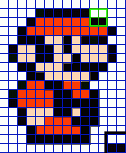
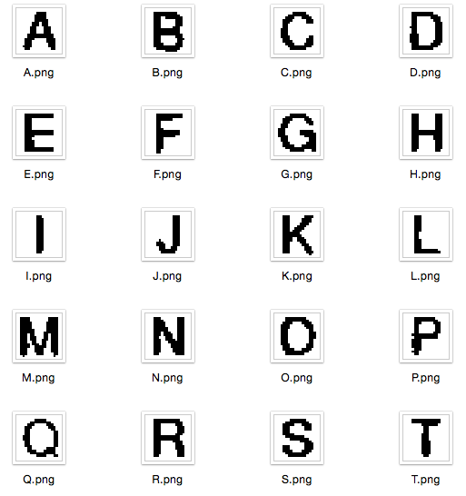

Breaking The Silk Road's Captcha Redux: The Silk Road 2
=====================================================================

[Mike A. Owens](http://mike.filespanker.com/), September 30th, 2014

After publishing [Breaking the Silk Road's Captcha](./index.md), one of the
most common questions I received from the nerd community and journalists alike
concerned its applicability to "The New Silk Road", or "Silk Road 2", the
successor to the original.

First: it was a bit of a fluke that the code I wrote years ago targeted The Silk
Road.  It could've easily have been an unknown message board, but apparently
people are *really* interested in the dark net.  I just saw an interesting
problem and went about solving it.  Still, after enough prodding, I couldn't
help but check out what Silk Road 2 was doing with captchas.

Bear in mind, while I have a history in image processing, and a few more of the
"fuzzy" areas of computer science where "statistically works" is the norm,  I'm
not an expert on optical character recognition.  That said, given the response,
I spent a few hours breaking it, and anyone that followed the original article
would probably be interested in the differences.


The Silk Road vs. The Silk Road 2
---------------------------------

The Silk Road 2 doesn't require a captcha solve to log in, just to create an
account.  There may be other areas of the site that use it as well, but this is
the one I'm looking at.

I was [informed](https://reddit.com/r/programing/comments/2hisfk/breaking_the_silk_roads_captcha/cktxxzt)
that the SR captchas I broke were generated by a PHP CMS called ExpressionEngine.

SR2 uses a Rails plugin called simple-captcha.  [The original(?) branch](https://github.com/macarthy/simple-captcha-mirror)
seems to be unmaintained since 2008, but [various](https://github.com/galetahub/simple-captcha)
[forks](https://github.com/ignacy/simple-captcha-mirror) have sprung up since
then.  I'm not sure which SR2 is using, but I used [galetahub](https://github.com/galetahub/)'s
fork for research.

The short answer is: SR and SR2 captchas aren't alike, but SR2 is just as
trivial.  SR2 is also probably fully solvable (99%+) without machine learning,
as all of its operations are reversible.

First Look
----------

These don't look too bad.


Quick Facts:

  * No background to remove.
  * 5 characters, matching `/\A[A-Z]{5}\z/`
  * Not "word-like", so no clever dictionary tricks
  * One effective channel of color information
  * Unlike SR1, these characters aren't just translated and rotated, there are
    actual warps going on.

The warps all look very similar, too, so let's see what's going on.


A deform that isn't
----------------------------------------

Because of the captcha filename, I knew it was generated by something called
"simple_captcha".  It sped things up to have access to the source, but we're
talking a few hours, not weeks.  As 90% of things like this are only
off-the-shelf ImageMagick warps, it would've been a reasonable list to work
through manually.  Given enough examples, ignorance of the mechanism wouldn't
have been much of a hurdle anyway.

But because we can, let's check out [the source](https://github.com/galetahub/simple-captcha/blob/2602bf19a63df25929960b5a7721a9d265281ec1/lib/simple_captcha/image.rb#L60),
particularly this bit that tells ImageMagick what to do:

```ruby
params = ImageHelpers.image_params(SimpleCaptcha.image_style).dup
params << "-size #{SimpleCaptcha.image_size}"
params << "-wave #{amplitude}x#{frequency}"
params << "-gravity \"Center\""
params << "-pointsize #{SimpleCaptcha.point_size}"
params << "-implode 0.2"
```

The `implode` at the end is constant.  And it's reversible.  They apply an
`-implode 0.2`? Let's apply an `-implode -0.2`.

```bash
for i in * ; do
  convert "$i" -implode -0.2 "$i-exploded.png";
done
```

And the effect of running the inverse operation on our examples:

| Original                       | Exploded                                    |
| -------------------------------|---------------------------------------------|
|||
|||
|||
|||
|||

Short of anti-aliasing and JPEG artifacts, at this image resolution and font
size, the `implode` may as well not be there.  The effect that makes this text
look most "strange" to humans is absolutely no hurdle to software.

Even if the `implode` used a random variable parameter, we could try different
candidate parameters, and via binary search, determine which ones create the
shortest, straightest, edge lengths.  We'd end up with a decent approximation of
the parameter used.


Riding the Wave
---------------

What we have now is normal text, sitting on a sine wave.  There's only y-axis
distortion, and it's minor.

I could stop here and tell you that, given this bit of pre-processing, the
method used in the original article will solve a non-joke amount of these
captchas.  But here's the bit where they *can* be solved with a damn-near
100% success rate.

Check [this](https://github.com/galetahub/simple-captcha/blob/2602bf19a63df25929960b5a7721a9d265281ec1/lib/simple_captcha/image.rb#L35):

```ruby
def distortion(key='low')
  key =
    key == 'random' ?
    DISTORTIONS[rand(DISTORTIONS.length)] :
    DISTORTIONS.include?(key) ? key : 'low'
  case key.to_s
    when 'low' then return [0 + rand(2), 80 + rand(20)]
    when 'medium' then return [2 + rand(2), 50 + rand(20)]
    when 'high' then return [4 + rand(2), 30 + rand(20)]
  end
end
```


The two random numbers generated here are passed to the `-wave` parameter as
the amplitude and frequency.  [According to the ImageMagick docs](http://www.imagemagick.org/Usage/warping/#wave),
the starting point of the wave (on the x axis) is always zero.

By iterating on these two numbers, binary search style, an inverse wave can
be generated that will line them up perfectly like little green soldiers.  The
trick is defining a fitness function that can tell how much of the baseline of
these characters fit a wave with a given amplitude and frequency.

I didn't follow this route because it seemed *Reasonably Fucking Hard*, but I'll
send a virtual six-pack to anyone that demonstrates this.  *(That is: Take the
example "exploded" images on the right, and write an algorithm that will find
inverse of the wave, which would sit the characters back on a straight baseline.)*

Because the distortion is so minor, I just skipped this, and hoped probability
worked in my favor down the road.

Better Segmenting (Object Extraction)
-------------------------------------

Notice that, unlike SR1, these captcha characters aren't spaced far apart.  It's
as if they're oddly [kerned](http://en.wikipedia.org/wiki/Kerning).  Check out
the horizontal overlap between the `T` and `J` of the last example, `XCUTJ`:


The segmentation method presented in the original article would fail to segment
these two characters, as it only looks for blank vertical lines.  It fails
almost *half* the time.  We need a less naive algorithm to extract individual
characters.

### Aside: Marching Squares?

The [Marching Squares algorithm](http://en.wikipedia.org/wiki/Marching_squares)
can trace objects in a bitmap.  (Here are [Ruby](https://gist.github.com/mieko/df86aa23c21d658a3552)
and [C++](https://gist.github.com/mieko/3c17c41b8be9f2598c12) implementations I
just ripped out of a toy I wrote years ago.)

Phillip Spiess has [the best write-up](http://devblog.phillipspiess.com/better%20know%20an%20algorithm/2010/02/23/better-know-marching-squares.html)
I've seen on this, so I've stolen his animation:



The idea is, you let it loose on a bitmap, and it'll walk around the first
object it gets to, and return it as an array of points.  If you combine that
with a path simplification pass, like the [Douglas Peucker algorithm](http://en.wikipedia.org/wiki/Ramer%E2%80%93Douglas%E2%80%93Peucker_algorithm),
you've got a pretty reasonable polygon.  ([Here's an implementation I
transliterated into Ruby for the same project](https://gist.github.com/mieko/7c1f5a3b51423c4322e2).)

The problem is *removing* the character we just found, without implementing a
scan-line polygonal fill (check Cairo's: these are complex even if you're being
stupid about it, and almost research-paper-quality if you care about the edge
cases like they do).  

We want to remove the character we just extracted, so that the next time
we run Marching Squares on it, we'll get the next character.  Or generate a new
set of coordinates that'd point to the next "object", which is non-trivial if
you have a strict concept of "next".

This gets quite complicated outside of a graphics library.  Besides, per-pixel
bitmap operations are slow *(really slow)* in Ruby.  Let's find something simpler.

### Flood Fill & Porter Duff Compositing

This was smarter, faster, and a lot less work.

  * Duplicate the captcha image
  * Find the first black pixel, so that we're "in" a character
  * Flood-fill it with "white" to remove it from the working data
  * Find the differences between the "original" and the version with the
    character erased, via compositing operators, to yield a version with just
    the extracted character
  * Repeat until exhaustion

The code looks something like this:

```ruby
def each_extracted_object(im)
  return enum_for(__method__, im) unless block_given?

  loop do
    xy = first_black_pixel(im)
    break if xy.nil?

    # Save the original
    copy = im.clone

    # Erase it from our working image
    im = im.color_floodfill(xy[0], xy[1], 'white')

    # Exclusion to get the difference, trim and yield
    copy.composite!(im, 0, 0, Magick::ExclusionCompositeOp)
    copy = copy.negate.trim('white')

    # This stuff creates a bit of garbage
    GC.start

    yield copy
  end
end
```

Visually, it'd look something like the following, with the intermediate steps
displayed:

| Step                                                                  | Example                                                |
| ----------------------------------------------------------------------|--------------------------------------------------------|
| Original image (monochrome for simplicity)                            |  |
| Flood fill at first left-most black pixel                             |                |
| Find the difference between the original and the flood-filled version |                 |
| Invert to get the character by itself.                                |                 |

The result of step two is now our working image to extract further characters
from, and the result of step four should have the isolated character.

All of that stuff runs at near-native speed because we're leaning on ImageMagick
for the heavy lifting.

Note that this method (along with Marching Squares) would fail if any character
in the character set consisted of more than one flood-fillable object.  For
example, the dot and stem combo of a lower-case `i` or `j`.  In that case, it'd
probably be easiest to totally discard extracted objects that don't hit minimum
dimensions.  Another approach would be to extract all objects, and combine those
that completely overlap on the x axis.


Pattern Matching
----------------

With the SR1 captcha, to separate the background from the foreground characters,
we had to run it through a pretty harsh contrast filter.  That turned:

 into 

The character data that remained was enough to do the job, but the sparseness of
pixel data left something to be desired.  The generated "font" was a little
bolder because it averaged everything out.

However, with this captcha, we get to keep nice, fat letters.  Averaging the
data in 40 solved captchas yielded a set like this:



This was generated by taking all the examples of, say, an *M*, and compositing
them over each other with an opacity of `1 / number_of_m_examples`, and then running a
threshold at 50%.  

Instead of going the neural network route, just finding the character with the
greatest number of matches to the "font" worked at about 96%, per-character,
even considering the "wave" was still in the data.

```ruby
def font_match(im, candidate)
  score = 0
  (0...FONT_HEIGHT).each do |y|
    (0...FONT_WIDTH).each do |x|
      if black?(im.pixel_color(x, y)) == black?(candidate.pixel_color(x, y))
        score += 1
      end
    end
  end

  return score.to_f / (FONT_WIDTH * FONT_HEIGHT)
end

```

`0.96 ** 5` is approximately 81%, which was the whole-captcha break rate
achieved.

For the curious, with 40 example captures, and 3 hours of training, the neural
network had a break rate of 45%.  A larger corpus and more training time
would've brought it to similar or better levels than the SR1 example.

Conclusion
----------

Breaking bad captchas is pretty easy.  Reusing some boilerplate code from the
SR1 experiment, this unrelated captcha was broken in about three hours.  I
believe with a little (clever) work, this one can be solved to > 99%.

I'm still reluctant to send pre-packaged captcha-breaking code out into the
wild, especially since this break would allow abusing any other application that
uses the simple-captcha gem.

I'm also curious about the utility of captcha systems in 2014.  I was routinely
told that, through shady online services, actual humans will solve your
captchas at a cost of less than $1 USD per thousand.  And they won't get hung
up, even on good captchas, like reCAPTCHA.

Regardless, I've thought enough about captchas for a lifetime.

\- [mieko](http://mike.filespanker.com/)

About the Author
----------------
Mike is (still) amazing, and sometimes accepts well-paying, remote, software
gigs.

 * [@leetliekmiek](https://twitter.com/leetliekmiek)
 * [/u/miekao](https://www.reddit.com/user/miekao/)
 * mike@filespanker.com
